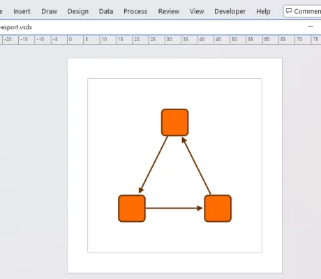
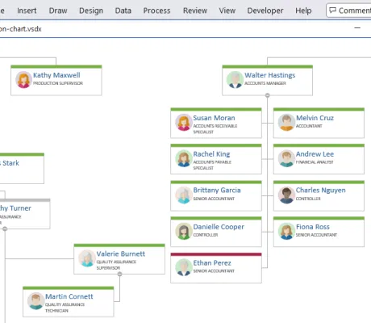
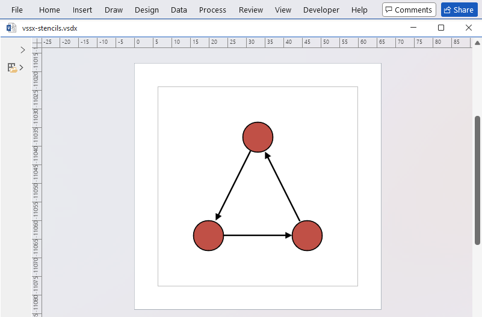
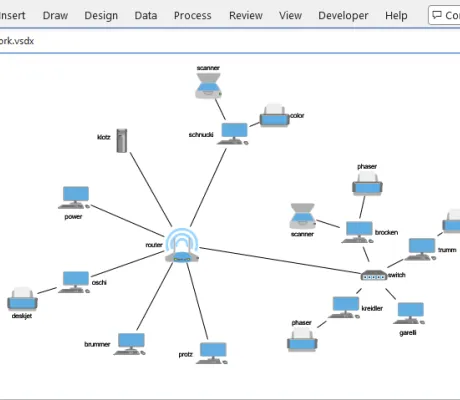

# VSDX Export for yFiles for HTML Demos

This directory contains source code demo applications and tutorials to help you get started.
They present best practices for working with the VSDX Export and show how to realize your requirements.

The recommended way of browsing the demos is the demo server:

````shell
npm start
````

# [Vsdx Export](vsdx-export)

This folder and its subfolders contain demo applications which show different features of the VSDX Export.

&nbsp;&nbsp;&nbsp;&nbsp;&nbsp;&nbsp;&nbsp;&nbsp;&nbsp;&nbsp;&nbsp;&nbsp;&nbsp;&nbsp;&nbsp;&nbsp;&nbsp;&nbsp;&nbsp;&nbsp;&nbsp;&nbsp;&nbsp;&nbsp;&nbsp;&nbsp;&nbsp;&nbsp;&nbsp;&nbsp; | Demo | Description
--- | --- | ---
 | [Basic VSDX Export](vsdx-export/basic/) | Shows how to export a yFiles diagram to a VSDX file.
 | [Multi-Graph Export](vsdx-export/multigraph/) | Shows how to export multiple graphs to a single VSDX file.
 | [Organization Chart](vsdx-export/orgchart/) | The VSDX Export integrated into an interactive viewer for organization charts.
 | [VSSX Stencils](vsdx-export/stencils/) | Shows how to apply VSSX stencils to nodes in the exported diagram.
 | [Styles Viewer](vsdx-export/stylesviewer/) | Displays several sample graphs from various domains and exports them to VSDX.
 | [VSDX Template](vsdx-export/vsdxtemplate/) | Shows how to use a VSDX file as a template for exporting a yFiles diagram.
