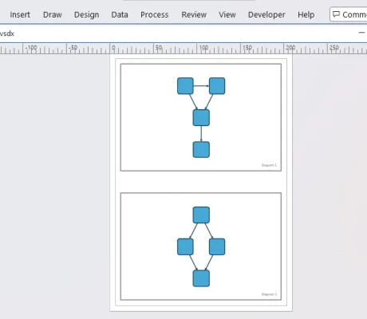

# Multi-Graph Export Demo – yFiles for HTML

Demo

This demo shows how to use the `VsdxExport` with multiple graphs.

### Things to do

- Click on the "Export to VSDX" button to export all graphs to a single VSDX file.
- Each graph will be exported to a separate page in the VSDX file.
